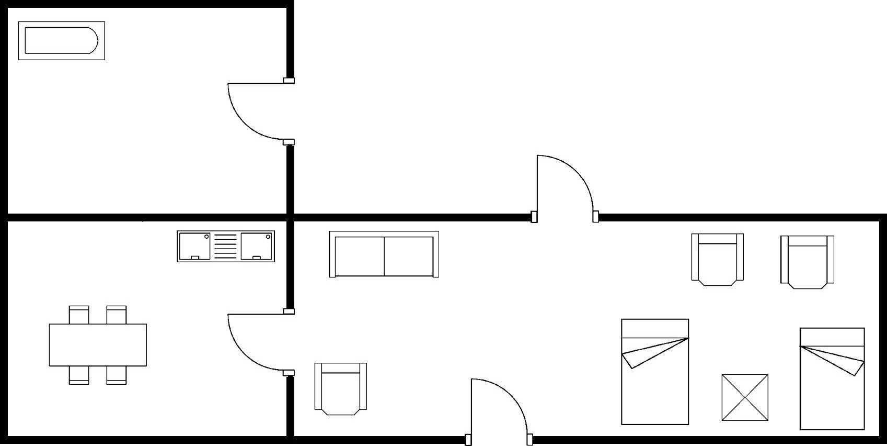

# Development Thoughts

## Initial Analysis

### 1. Dataset Assessment
Looking at the dataset first, the target task is door detection. From a human perspective, this is quite straightforward - doors in security drawings are clearly visible and distinguishable. Using YOLO architecture should yield good results.



### 2. Label Analysis
The dataset contains only one class: `0: door`. The bounding box coordinates are already normalized, which is excellent for training.

**Example labels:**
```
0 0.5645 0.9202 0.0913 0.1925
0 0.2952 0.2512 0.1002 0.1714
0 0.6388 0.4225 0.0878 0.1984
0 0.2964 0.7676 0.1031 0.1643
```

### 3. Data Quality Assessment
After eyeball checking, the dataset appears clean with minimal noise and outliers. This allows me to use the smallest YOLOv11n model, which has fewer parameters, enables rapid results, and maintains good quality.

## Dataset Statistics

### Training Set
- **Images**: 363 files
- **Labels**: 363 files (excluding classes.txt)

### Validation Set
- **Images**: 147 files
- **Labels**: 147 files (excluding classes.txt)

### Summary
- **Total Images**: 510
- **Total Labels**: 510
- **Train/Validation Split**: ~71.2% / 28.8%

## Technical Decisions

### 4. Model Format Selection
Ultralytics provides multiple model output formats. Since the final inference will run on Mac with CPU-only environment, I chose ONNX format for better compatibility and cross-platform support.

### 5. Demo Interface
For demonstration purposes, I decided to quickly build a Gradio interface that provides:
- Visual bounding box plots
- JSON format output

## Training Process

### 6. Training Strategy
The official recommendation suggests 100-300 epochs. Concerned about long training times, I set early stopping - if model performance doesn't improve for 50 epochs, training stops early.

### 7. Hardware Acceleration
Training on Mac was taking too long. I launched an AWS g4dn instance with T4 GPU and completed training within 10 minutes, finishing at 212 epochs.

## Results Analysis

### 8. Training Success
From `runs/train/exp/results.png`, the model training was very successful:
- **Recall and Precision**: Achieved successful door classification within the first 10 epochs
- **Bounding Box Learning**: Took longer to stabilize, with `val/box_loss` becoming stable around 100 epochs
- **mAP50-95**: Final metric reached 0.85-0.9, indicating excellent door detection capability
